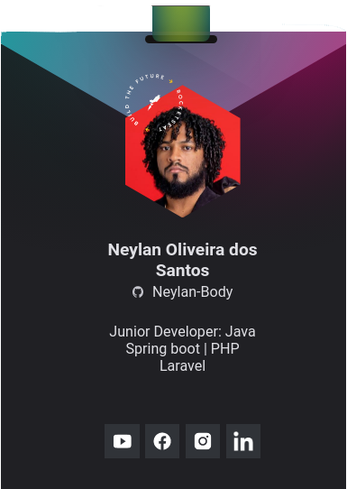

<h1 align="left">👋 Hello everybody</h1>
<h3 align="left">Technology lover and everything I learn from it.</h3>

  

- 🔭 I’m currently working in [Radix Engenharia e Software](https://www.radixeng.com.br)

- 📚 I have a degree in **Information Systems** Course at [UESB](http://www.uesb.br/).

- 🌱 I’m currently working with **Java Spring Boot, MongoDB, OracleSQL, RabbitMQ, KAFKA, Rundeck, Grafana and Docker**
 
- 👨‍💻 All of my projects are available at [My repositories](https://github.com/Neylan-Body?tab=repositories)

- 📫 How to reach me **neylan2011@gmail.com**

- ⚡ Fun fact **I currently work as a Java Developer**

<h3 align="left">Connect with me:</h3>

<h3 align="left">Languages and Tools:</h3>

           
 

&nbsp;

